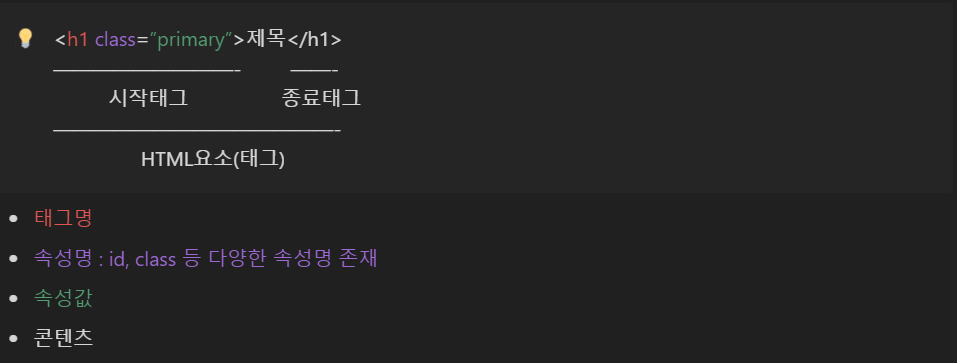

### 참고자료 : 유튜브(짐코딩의 CODING GYM) - HTML/CSS 강의

### <br>**주소 : [유튜브 링크](https://youtube.com/playlist?list=PLlaP-jSd-nK-ponbKDjrSn3BQG9MgHSKv)**

<br><br>

# EP01. 개발환경 구성

## 1. Visual Studio Code 인터페이스

- Activity Bar : 가장 좌측 막대바
  1. EXPLORER : 폴더 등에 액세스해서 작업 파일을 열거나 생성할 수 있음
  1. Search : 검색 기능
  1. Source Control : 소스 제어
  1. Run and Debug : 디버그
  1. Extension : 확장 프로그램 설치
- Side Bar : Activity Bar 클릭시 나타나는 창
  - Activity Bar에서 선택한 기능을 사용하는 영역
- Panel : 상단 메뉴 View → Terminal 또는 Ctrl+` 입력시 나타나는 창
  - 터미널이나 디버그 콘솔과 같은 다양한 기능 제공
- Editor 영역 : (메인 창)실제 코딩 작업이 이루어지는 영역
- Status Bar : 최하단의 파란색 바
  - Visual Studio Code의 상태를 나타내는 영역


## 2. Visual Studio Code 확장 기능 설치

### 설치방법 : Activity Bar의 Extension 클릭하여 원하는 확장 기능 검색 후 설치

- Korean Language Pack for Visual Studio Code
  - 한국어 인터페이스 제공
- indent-rainbow
  - 탭 영역을 서로 다른색으로 색칠해주어 구분을 편하도록 함
- Auto Rename Tag
  - HTML의 여는태그/닫는태그 중 한 쪽을 수정했을 때 다른 쪽 태그를 동시에 수정해줌
- CSS Peek
  - HTML 태그에 정의된 CSS를 금방 찾을 수 있도록 도와주는 확장 기능
  - HTML코드에서 Ctrl+좌클릭을 통해 해당 태그의 CSS로 자동 이동함
- HTML to CSS autocompletion
  - 정의된 CSS가 HTML 문서의 어디에서 사용되었는지 쉽게 찾을 수 있도록 도와주는 확장 기능
  - HTML 문서에 선언된 클래스명을 CSS에서 입력 시 자동완성 기능 제공
  - 선언된 스타일에 마우스를 올리면 어떤 HTML 태그에 사용되었는지 오버레이 창을 통해 확인 가능
- HTML CSS Support
  - HTML 클래스명 입력 시 자동완성 기능 제공
- Live Server
  - HTML/CSS 수정(저장) 시 새로고침 없이 즉각즉각 적용된 웹페이지를 볼 수 있게 해줌
  - Status Bar의 Go Live 버튼을 통해서 실행 또는 탐색기에서 우클릭→Open with Live Server를 통해서 실행 가능
- Prettier - Code formatter
  - 코드를 예쁘게 정렬해주는 Code formatter
  - 적용 및 설정 방법
  1. 설정(Ctrl + ,)에서 format on save 검색 → Editor: Format On Save 체크
  1. 설정 검색창에 prettier 검색 → Tab Width 2칸 권장
  1. 설정 검색창에 prettier quote 검색 → Prittier: Single Quote 체크
  1. TypeScript > Preferences 및 JavaScript > Preferences의 Quote Style을 auto에서 single로 변경
  1. 설정 검색창에 default formatter 검색 → Editor : default formatter를 Prettier 로 설정
  1. HTML 문서에서 우클릭 → 문서 서식 프로그램 → Pritter 설정

<br><br>

# EP02. HTML이란 무엇인가?

## 1. HTML의 개념

HTML : Hyper Text Markup Language

- Hyper : 과도하거나 지나친 → 기존 문서보다 과도한, 최고의 기능을 제공함
- Markup : 원고의 교정표시 → 각 텍스트에 표시(태그)를 통해 마킹하여 우리가 원하는 스타일, 기능대로 텍스트를 표현

HTML은 엄연히 프로그래밍 언어는 아니며, 프로그래밍 언어에 비해 비교적 쉽게 다룰 수 있는 Markup 언어

## 2. HTML의 태그


※콘텐츠가 없는 태그는 종료태구가 없는 경우도 있다. (ex. br태그, hr태그 등)

<br><br>

## 3. HTML문서의 기본구조

### HTML은 html 태그 내에 작성되며, head와 body로 구성된다.

```
<DOCTYPE html>
<html lang="ko">
<html>
    <head>
    </head>
    <body>
    </body>
</html>
```

1. DOCTYPE : 현재 문서가 어떤 버전으로 작성되었는지 표시 (가장 상단에 표시)
   - HTML : HTML 5버전
1. html 태그 : 문서의 시작과 끝을 나타내는 태그
   - lang : 현재 웹문서가 어떤 언어로 작성되었는지 나타내는 속성 (웹 접근성 향상)
1. head 태그 : html의 자식태그로 웹문서의 문서 정보를 담당하는 공간
   - 실제 브라우저에는 표시되지는 않음
1. body 태그 : html의 자식태그로 실제 브라우저 바디에 표시되는 공간
   - 우리가 브라우저에서 보는 모든 요소들이 body에 해당

<br><br>

## 4. HTML 주석

주석은 `<!--[주석내용]-->` 또는 원하는 영역 드래그 후 Ctrl + '/'로 설정이 가능하다.
주석의 역할은 코드에는 영향을 끼치지 않으며 메모를 할 수 있다.
