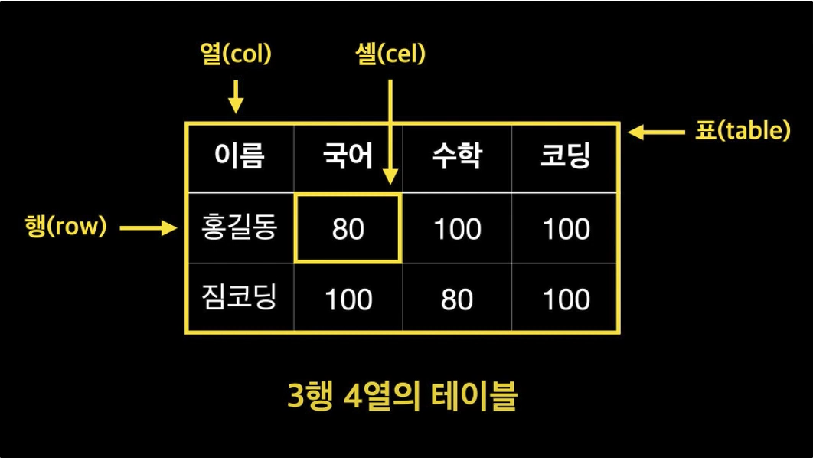
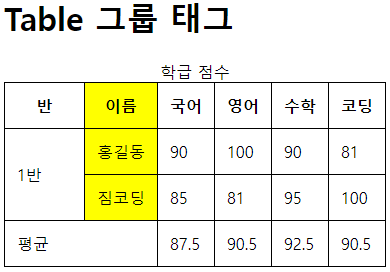

# EP 03. Emmet

### Emmet이란? HTML/CSS 작성 시 자동완성 기능을 제공하여 작성 시간을 단축시켜주는 확장 기능

<br>

1. 자식노드(>)

- 예시 : div > ul > li

```
<div>
    <ul>
        <li></li>
    </ul>
</div>
```

---

2. 형제노드(+)

- 예시 : div > ul + ol + div

```
<div>
    <ul></ul>
    <ol></ol>
    <div></div>
</div>
```

---

3. 반복(\*)

- 예시 : div > ul > li \* 3

```
<div>
    <ul>
        <li></li>
        <li></li>
        <li></li>
    </ul>
</div>
```

---

4. id 선언 (#)

- 예시 : span#item

```
<span id="item"></span>
```

→ id명이 "item"인 span 태그 생성

---

5. 클래스 선언 (.)

- 예시 : p.container

```
<p class="container"></p>
```

---

6. 컨텐츠 ({})

- 예시 : p.container{Hello World!}

```
<p class="container">Hello World!</p>
```

---

7. 자동 넘버링 ($)

- 예시 : p.container{item$}\*5

```
<p class="container">item1</p>
<p class="container">item2</p>
<p class="container">item3</p>
<p class="container">item4</p>
<p class="container">item5</p>
```

---

<br><br>

# EP 04. HTML 기본 태그

## 4-1. 폰트(Font) 태그

<br>

```
- <h1>~ <h6> : 웹페이지의 제목 또는 부제목을 표현
    - 숫자가 작을 수록 큰 제목을 뜻한다. (css를 통해 서식 수정 가능)

- <p> : 하나의 문단을 표시

- <hr> : 가로선을 표시 (종료태그 없음)

- <br> : 줄바꿈(개행) (종료태그 없음)

- <i> : 컨텐츠를 이텔릭체로 표시

- <em> : 컨텐츠를 이텔릭체로 강조하여 표시

- <b> : Bold 표시

- <strong> : Bold로 강조하여 표시
```

- 강조표시의 차이 : 시각장애인을 위한 스크린리더 사용 시, 텍스트가 음성으로 출력 될 때 강조된 텍스트는 거센 억양으로 음을 내어 구분을 용이하게 한다. (웹 접근성 향상)

<br><br>

---

## 4-2. 목록(List) 태그

<br>

```
- <ol> : 순서가 있는 목록 표현 (1, 2, 3... 번호순으로 넘버링)

- <ul> : 순서가 없는 목록 표현 (style 통해 글머리 모양 지정 가능)

- <li> : 목록 태그의 하위 항목으로 사용(자식 태그)

    - <ol>,<ul>은 목록의 속성을 나타내고, 컨텐츠는 <li>에 포함됨
- <dl> : Definition List(정의 목록)으로 사전처럼 용어를 설명하는데 사용

- <dt> : 용어의 제목을 나타내는 태그 (<dl> 의 자식태그)

- <dd> : 용어 설명을 나타내는 태그 (<dl> 의 자식태그)
```

- 주의사항
  - `<dl>`는 반드시 하나 이상의 `<dt>`, `<dd>` 쌍의 태그를 가져야 한다.
  - `<li>`, `<dt>`, `<dd>`는 독립적으로 사용할 수 없다.
  - `<ul>`는 반드시 `<li>`를 자식으로 보유해야 한다.

---

<br><br>

## 4-3. 표(Table) 태그

### 테이블의 개념


**출처 : [짐코딩의 CODING GYM](https://youtu.be/uYli5PMlOrw)**

---

### 테이블 기본 태그

```
- <table> : 테이블이라는 것을 지정, 하나의 테이블 전체가 이 태그로 감싸짐
- <caption> : 표의 제목이나 설명을 작성
- <tr> : 표의 하나의 행, 자식태그로 <th> 또는 <td>가 반드시 필요
- <th> : 표의 제목 행을 의미, Bold 및 중앙정렬이 Default값 (<tr>의 자식태그)
- <td> : 표의 일반 열을 의미 (<tr>의 자식태그)
```

---

### 테이블 그룹 관련 태그

- 그룹으로 묶는 이유는 그룹별로 코드를 관리 및 style 지정하기 용이해서

```
- <tfoot> : 표의 하단 영역(일반적으로 합계, 평균 등 통계를 나타내는 마지막 행)을 지정
- <tbody> : 표의 일반적인 데이터 영역
- <thead> : 표의 제목 영역
- <colgroup> : 각 열을 grouping할 수 있는 태그
- <col> : 각 열을 나타냄, class 선언을 통해 각 열별로 서식 지정 등이 가능(colgroup)의 자식 태그
```

---

### 테이블 태그 관련 속성

- 대부분 테이블 태그에 지접 지정하는 속성은 웹표준에 어긋나므로 CSS를 통해 별도 작성하는 것이 바람직하다. (병합 정도만 사용)

```
- colspan : 열을 병합하는 속성
- rowspan : 행을 병합하는 속성
```

- 사용예시

`<td rowspan="2">1반</td>`
<br> - 이 행부터 두번 째 행까지 병합하여 표시하겠다. (병합되는 행에는 해당 td 태그 생략)

<br>

`<td colspan="2">평균</td>`
<br> - 해당 열이 가로로 2칸만큼 차지하게 됨

---

### 적용 예시 및 코드

<br>



```
<style>
      table {
        border: 1px solid black;
        border-collapse: collapse;
      }

      th,
      td {
        border: 1px solid black;
        padding: 12px;
      }
      .col1 {
        width: 80px;
      }

      .col2 {
        background: yellow;
      }
    </style>
  </head>
  <body>
    <h1>Table 기본</h1>
    <table>
      <caption>
        프로필 테이블
      </caption>
      <tr>
        <th>이름</th>
        <th>취미</th>
        <th>특기</th>
      </tr>
      <tr>
        <td>홍길동</td>
        <td>도술</td>
        <td>축지법</td>
      </tr>
      <tr>
        <td>짐코딩</td>
        <td>헬스</td>
        <td>코딩</td>
      </tr>
    </table>
    <hr />

    <h1>Table 그룹 태그</h1>
    <table>
      <caption>
        학급 점수
      </caption>
      <colgroup>
        <col class="col1" />
        <col class="col2" />
        <col class="col3" />
        <col class="col4" />
        <col class="col5" />
        <col class="col6" />
      </colgroup>
      <thead>
        <tr>
          <th>반</th>
          <th>이름</th>
          <th>국어</th>
          <th>영어</th>
          <th>수학</th>
          <th>코딩</th>
        </tr>
      </thead>

      <tbody>
        <tr>
          <td rowspan="2">1반</td>
          <td>홍길동</td>
          <td>90</td>
          <td>100</td>
          <td>90</td>
          <td>81</td>
        </tr>
        <tr>
          <td>짐코딩</td>
          <td>85</td>
          <td>81</td>
          <td>95</td>
          <td>100</td>
        </tr>
      </tbody>

      <tfoot>
        <tr>
          <td colspan="2">평균</td>
          <td>87.5</td>
          <td>90.5</td>
          <td>92.5</td>
          <td>90.5</td>
        </tr>
      </tfoot>
    </table>
  </body>
```

---

<br><br>

# 소감

지금까지는 코딩을 위한 설정에 가까웠지만 본격적으로 태그를 배우고 직접 HTML을 작성하여 적용된느 것을 보니 비로소 뭔가 배우고 있다는 체감이 든다.

한가지 고민거리는 블로그 정리에 시간이 너무 오래걸린다는 것 ㅎㅎ..
강의를 듣는 시간보다 이를 정리하고 블로그에 올리는데 훨씬 더 오랜 시간이 걸린다.

그래도 내 것으로 체득하는 과정이라 생각하고 성실히 올리는 것이 맞다고 생각한다.
쓰다보면 쓰는 시간도 단축되고 markdown도 많이 친숙해질 것이다.
