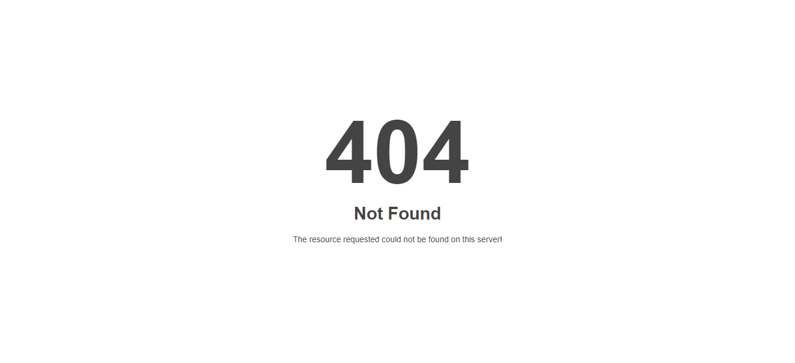

### **참고 자료 : 깃헙(Github) 블로그 만들기 (유튜브)**

### <br>**주소 : [유튜브 링크](https://youtube.com/playlist?list=PLIMb_GuNnFwfQBZQwD-vCZENL5YLDZekr)**

<br><br>

# GitHub 블로그 설정(SNS 링크 삽입, Conversion)

## 1. SNS 링크 삽입

- '\_config.yml'의 'Site Author', 'Site Footer' 문단에서 각각 링크 제공을 설정 가능

> ```
> (예시)
> - label: "GitHub"   #사이트명
>     icon: "fab fa-fw fa-github" #아이콘
>     url: "https://github.com/cjkangme"  #주소
> ```

아이콘의 경우 Font Awesome icon (**[링크](https://fontawesome.com/v5/search)**)에서 원하는 아이콘을 설정할 수 있다.

> 
> fab fa-fw <이미지 이름(fa-instagram)>을 입력하면 된다.

<br><br>

## 2. Conversion and Markdown processing

- '\_config.yml'의 'Conversion' 문단에서 설정
- markdown에 코드를 입력할 경우 Syntax 및 하이라이트 기능을 제공하는 기능
- 기본값은 markdown: kramdown, highlighter: rogue로 설정

> 사용예시
> 
>
> ```python
> a = int(input("Enter a: "))
> b = int(input("Enter b: "))
>
> try:
>     division = a / b
>     print(division)
> except ZeroDivisionError as err:
>     print("Please enter valid values.", err)
> else:
>     print("Both values were valid.")
> finally:
>     print("Finally!")
> ```

위와 같이 코드 블록 내 입력된 코드에 대해 자동으로 syntax 및 highlights를 제공한다.

<br><br>

## 3. Outputting

- '\_config.yml'의 'Outputting' 문단에서 설정
  - pagemate : 한 페이지에 보여줄 게시글 수
  - timezone : 블로그의 기준 시간 (한국의 경우 Asia/Seoul)
    <br>(**[timezone 참조 링크](https://en.wikipedia.org/wiki/List_of_tz_database_time_zones)**) - TZ database name 입력

> 설정 예시
>
> ```
> # Outputting
> permalink: /:categories/:title/
> paginate: 5 # amount of posts to show
> paginate_path: /page:num/
> timezone: Asia/Seoul
> ```

<br><br>

# Category, Tags 기능 추가

## 1. 카테고리

- '\_config.yml'의 'category_archive' 문단에서 설정
- 설정 방법
  <br>

1. 'category_archive' 문단에서 'jekyll-archives'의 주석처리 제거
2. GitHub 블로그가 미러링된 폴더내에 '\_pages' 폴더를 생성하고 해당 폴더에 'category-archive.md' 파일 생성
3. 생성된 파일에 다음과 같이 작성
   ```
   ---
   title: "Category"
   layout: categories
   permalink: /categories/
   author_profile: true
   sidebar_main: true
   ---
   ```
4. '\_data' 폴더에서 'navigation.yml' 파일을 다음과 같이 수정
   ```
   main: - title: "Category" url: /categories/
   ```

- 설정 완료 후, posts 작성 시 categories 속성을 지정하는 것으로 카테고리 분류 가능

<br><br>

## 2. 태그

- 카테고리 설정방법과 동일

  <br>

1. '\_pages'폴더에서 'tag-archive.md' 파일 생성하여 다음과 같이 작성
   ```
   main:
   ---
   title: "Tag"
   layout: tags
   permalink: /tags/
   author_profile: true
   sidebar_main: true
   ---
   ```
2. '\_data' 폴더에서 'navigation.yml' 파일을 다음과 같이 수정
   ```
   - title: "Tag"
     url: /tags/
   ```

- 설정 완료 후, posts 작성 시 tags 속승을 지정하는 것으로 태그 지정 가능
  - 태그 복수 설정시 대괄호 안에 복수 입력 [태그1, 태그2, 태그3, ...]

<br><br>

# 404 에러 페이지 지정

- GitHub 블로그 내에서 올바르지 않은 url을 입력했을 때, 기본으로 설정된 페이지가 출력되지만, 사용자가 원하는대로 지정 가능

- 설정 방법

1. ‘\_pages’ 폴더에 ‘404.md’ 파일 생성
2. 다음과 같이 작성

   ```
   ---
   title: "Page Not Found"
   excerpt: "Page not found. Your pixels are in another canvas."
   sitemap: false
   permalink: /404.html
   ---

   
   ```

   해당 템플릿은 'test'폴더의 '404.md' 파일에서 참조 가능
   이렇게 설정 시 올바르지 않은 url을 입력했을 때 입력한 이미지가 웹페이지에 출력됨

<br>

단점 : markdown은 텍스트나 이미지 정렬을 지원하지 않아, 이미지 크기나 정렬이 맞지 않아 이미지가 한쪽에 치우치는 등 원하는대로 표시되지 않을 수 있다.

<br>

이 경우, HTML을 이용하여 정렬을 할 수 있다.

```
---
title: "Page Not Found"
excerpt: "Page not found. Your pixels are in another canvas."
sitemap: false
permalink: /404.html
---

<center>
    
</center>
```

위와 같이 HTML 태그를 이용하여 이미지를 삽입할 수 있다.

가장 바람직한 것은 CSS 파일을 별도로 작성하여 style을 부여하는 것이다.
